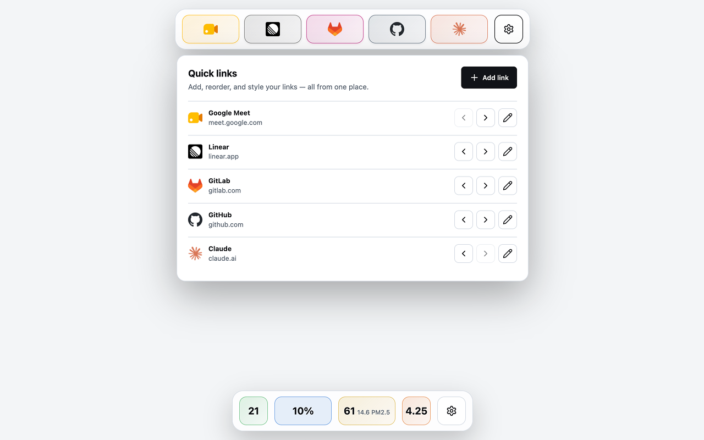

# Quiet Tab

A small Manifest V3 extension for Chromium-based browsers that turns the new
tab page into a personal favorites toolbar with local weather — nothing
else.

[](https://chromewebstore.google.com/detail/quiet-tab/dbcdpffdgfbjmdlomgheeijfkkjkhmma)



## Features

- Shows a personal quick-links toolbar pinned to the top of the new tab
  page, with a single horizontally-scrolling row of tiles.
- Manages links — add, edit, delete, and reorder — from a settings panel
  opened with the gear button (closes on Escape or a click outside).
- Opens saved favorites in the current tab.
- Uses site favicons with letter and custom-image fallbacks.
- Shows current weather for a city you choose: temperature, UV index (with
  a WHO-scale level label), today's rain probability, and air quality.
- Performs no background polling and has no analytics.

## Install

1. Clone or download this repository.
2. Open `chrome://extensions` in Chrome or another Chromium-based browser.
3. Enable **Developer mode**.
4. Click **Load unpacked**.
5. Select the repository directory.
6. Open a new tab.

The first launch shows an empty favorites bar and asks you to set a city
for the weather panel.

## Permissions And Privacy

The manifest requests only:

- `storage` to persist favorites and your chosen weather city via Chrome
  Sync, and a short-lived weather cache locally;
- `favicon` to display site favicons in the favorites bar;
- host access to Open-Meteo's forecast, air-quality, and geocoding
  endpoints to fetch weather for the city you choose.

Favorites and the chosen weather city are stored in `chrome.storage.sync`,
so they follow you to any other Chromium browser signed into the same Google
account with sync enabled and running this same extension — that's Chrome's
own built-in sync, not a project-run service. Favorites are not Chrome
bookmarks. A short-lived weather cache is stored in `chrome.storage.local`,
on this browser profile only.

There is no remote content feed of any kind — no news, no analytics, no
telemetry. See [Privacy](docs/privacy.md) for details.

## Development

Requirements: Node.js 20 or newer.

```bash
npm test
npm run check
```

Both must pass before opening a pull request. See
[CONTRIBUTING.md](CONTRIBUTING.md).

## Project Layout

```text
manifest.json         Manifest V3 configuration
src/newtab.html        New tab page markup
src/newtab.css         New tab page styles
src/newtab.js          Renders the favorites toolbar and weather panel
src/favorite*.js       Favorites persistence, service, icon/color logic
src/weather*.js        Weather persistence, service, API client, presentation
src/icons.js           Vendored SVG icon set
src/mutationLock.js    Serializes concurrent storage writes
src/storeUtils.js      Shared storage-validation helpers
test/                  node:test suite mirroring src/
docs/                  Architecture and privacy documentation
```

## License

MIT — see [LICENSE](LICENSE).
